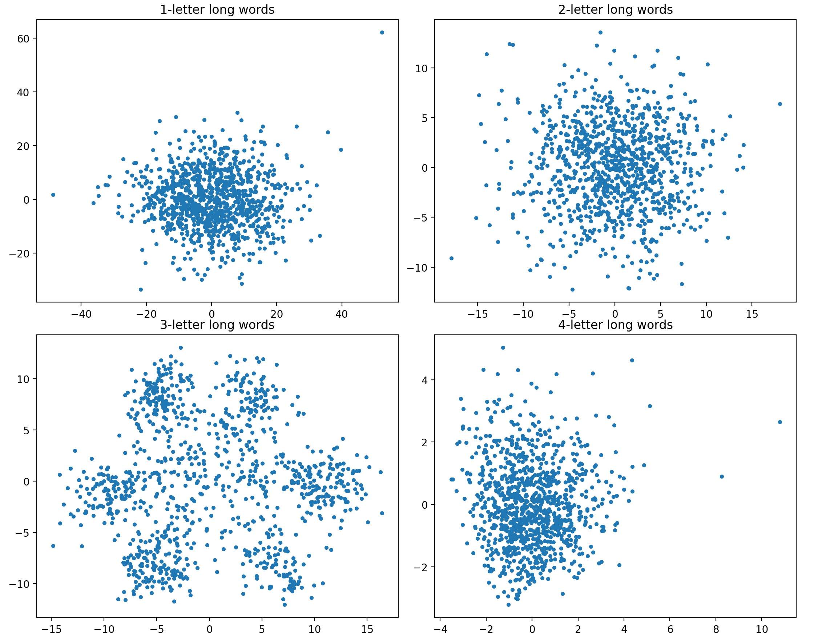
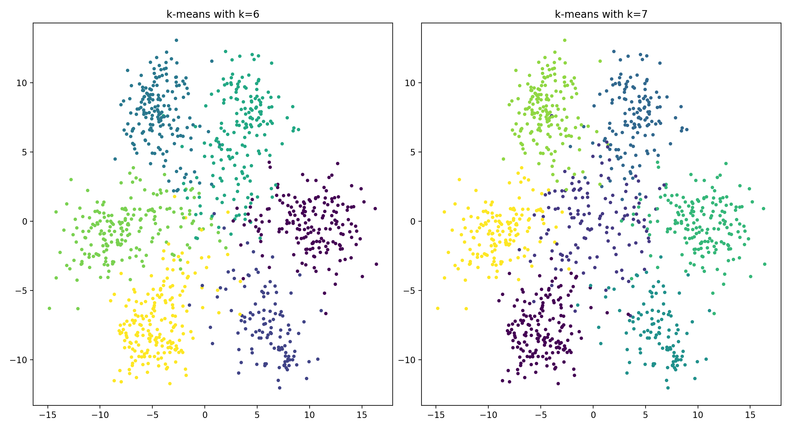

# Genetic Word Analysis
Data analysis example working with PCA And K-means on DNA
## Overview

We pull the DNA sequence data from [here](http://www.ihes.fr/~zinovyev/pcadg/ccrescentus.fa), break said data into 300 character chunks, and then run PCA and K-means on the resulting observations.

The point of this analysis is to statistically check for a guessed DNA word length.
We convert our chunks of DNA into feature vectors to run analysis on by cutting the chunks into words of a specified length and then counting the occurences of each word.
In the case of words of length one we have four possibilities: 'A', 'C', 'G', 'T'.
Words of length two would have a total of sixteen possible words, and so on for longer length words.
The idea here is that DNA has some underlying structure which is related to word length, so cutting each DNA chunk into words of the specified length and then running PCA on our feature vectors should hopefully reveal some insight.

### PCA



Cutting the dna chunks into words of length 3 seems to reveal some structure, so we move forward with this word length.
We see what looks like six groupings so let's try running a k-means algorithm with six or seven clusters.

### K-Means Clustering



The cluster counts that we checked match quite closely with the groupings we thought we were seeing from our PCA.
This is especially promising because the k-means algorithm is run over the full feature vector of the sixty-four possible words of length three.
This clearly shows that there is some underlying structure to DNA related to word lengths of three.

Now, with all of this known, we can logically guess why this clustering might arise given the underlying structure.
With word lengths of three, we might not actually want to read from the start of the DNA chunk that we arbitrarily made.
This gives us three possible offsets from which to read words from.
Similarly, we could read each DNA chunk backwards, also at three possible offsets.
This might then give us six possible clusters of each DNA chunk dpending on which direction and offset the DNA is meant to be read from.
The clusters we see from the k-means might then represent which of these possibilities each DNA chunk we had seems to most closely belong to based on the chunks own structure.
With additional knowlegde of DNA, we might guess that there is a seventh symmetric possibility which is that the chunk we made is most non-coding DNA.
This addition would make the fact that the seven cluster example seems to fit the PCA'd data better.
## Running

To output our PCA graphs for each of the word lengths
```
python -m analysis pca
```

To output our K-Means graphs for each cluster count
```
python -m analysis kmeans
```
